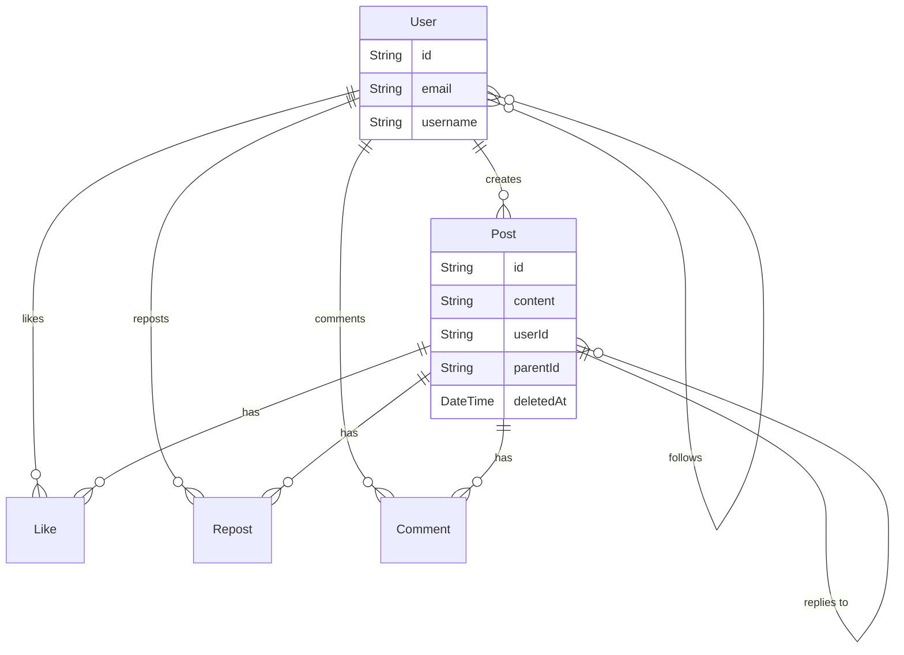

# Nexus Database Schema

## Overview

Using **PostgreSQL** with **Prisma ORM** for type-safe database access.

## Data Models

```prisma
// User Model
model User {
  id          String   @id @default(cuid())
  email       String   @unique
  username    String   @unique
  name        String
  displayName String?
  password    String
  bio         String?
  location    String?
  website     String?
  avatarUrl   String?
  bannerUrl   String?
  createdAt   DateTime @default(now())
  updatedAt   DateTime @updatedAt

  posts     Post[]
  likes     Like[]
  reposts   Repost[]
  comments  Comment[]
  followers Follow[] @relation("Following")
  following Follow[] @relation("Follower")
}

// Post Model
model Post {
  id            String    @id @default(cuid())
  content       String
  mediaUrls     String[]
  likesCount    Int       @default(0)
  repostsCount  Int       @default(0)
  commentsCount Int       @default(0)
  createdAt     DateTime  @default(now())
  updatedAt     DateTime  @updatedAt
  isPinned      Boolean   @default(false)
  deletedAt     DateTime? // Soft delete

  userId    String
  user      User     @relation(...)
  parentId  String?  // For threads/replies
  parent    Post?    @relation("ThreadPosts")
  replies   Post[]   @relation("ThreadPosts")
  likes     Like[]
  reposts   Repost[]
  comments  Comment[]
}

// Follow Model
model Follow {
  followerId  String
  followingId String
  createdAt   DateTime @default(now())

  follower   User @relation("Follower")
  following  User @relation("Following")

  @@id([followerId, followingId])
}

// Like Model
model Like {
  userId    String
  postId    String
  createdAt DateTime @default(now())

  user User @relation(...)
  post Post @relation(...)

  @@id([userId, postId])
}

// Repost Model
model Repost {
  userId    String
  postId    String
  createdAt DateTime @default(now())

  user User @relation(...)
  post Post @relation(...)

  @@id([userId, postId])
}

// Comment Model
model Comment {
  id        String   @id @default(cuid())
  content   String
  createdAt DateTime @default(now())
  updatedAt DateTime @updatedAt

  userId String
  user   User  @relation(...)
  postId String
  post   Post  @relation(...)
}
```

## Relationships



## Key Design Decisions

1. **Soft Delete** - Posts use `deletedAt` timestamp instead of hard delete
2. **Threading** - Posts use `parentId` for nested replies
3. **Composite Keys** - Like/Repost use `@@id([userId, postId])`
4. **Counters** - Denormalized `likesCount`, `repostsCount`, `commentsCount` on Post for performance