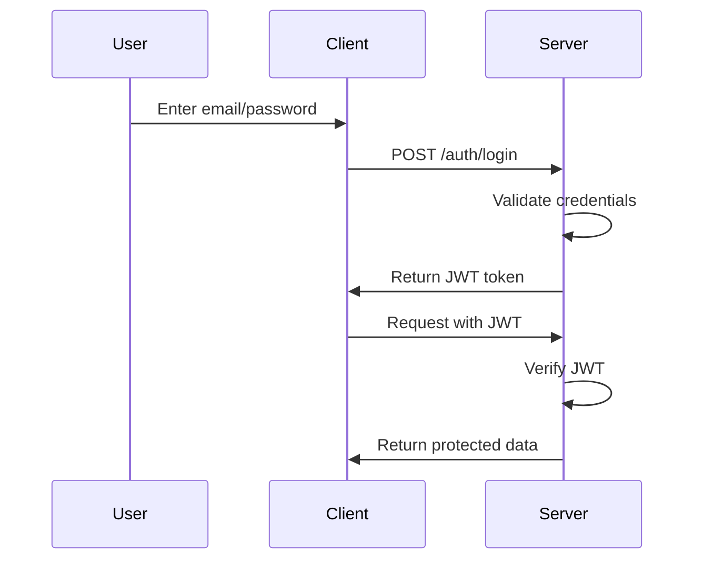

# Authentication with JWT

> How JWT authentication works in Nexus

## What is JWT?

JSON Web Token (JWT) - a compact, URL-safe token format for authentication.

## Flow in Nexus



## Files Involved

| File | Purpose |
|------|---------|
| `auth.service.ts` | Login/register logic |
| `jwt.strategy.ts` | Passport JWT strategy |
| `jwt-auth.guard.ts` | Protects endpoints |
| `schema.prisma` | User model |

## JWT in Nexus

```typescript
// auth.service.ts - Login
async login(user: any) {
  const payload = { sub: user.id, email: user.email };
  return {
    accessToken: this.jwtService.sign(payload),
  };
}

// jwt.strategy.ts - Verify token
async validate(payload: any) {
  const user = await this.prisma.user.findUnique({
    where: { id: payload.sub }
  });
  return user;
}
```

## Protected Endpoints

Use `@UseGuards(JwtAuthGuard)` on controllers:

```typescript
@UseGuards(JwtAuthGuard)
@Get('feed')
async getFeed(@Request() req) {
  return this.postsService.getFeed(req.user.id);
}
```

## Related
- [[NestJS-Guide]]
- [[REST-API]]

## Tags
#authentication #jwt #security